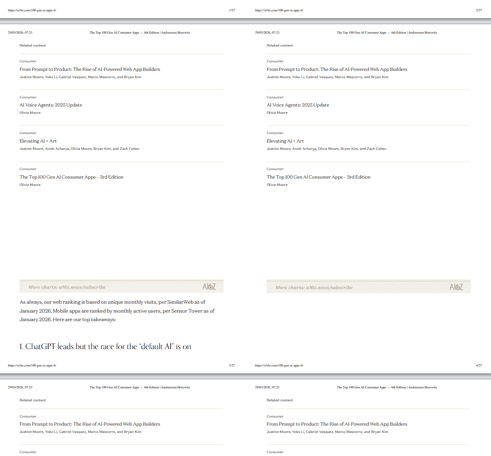
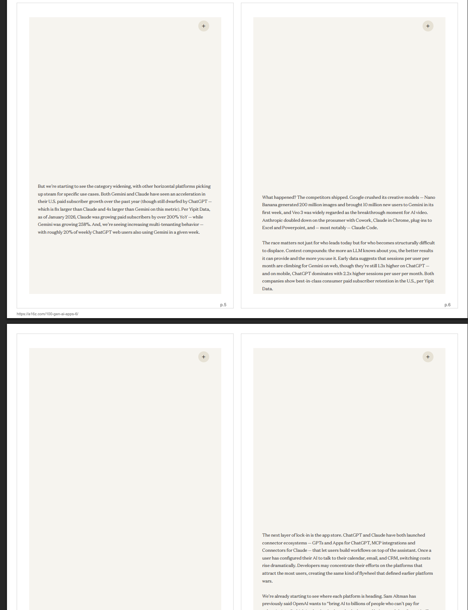
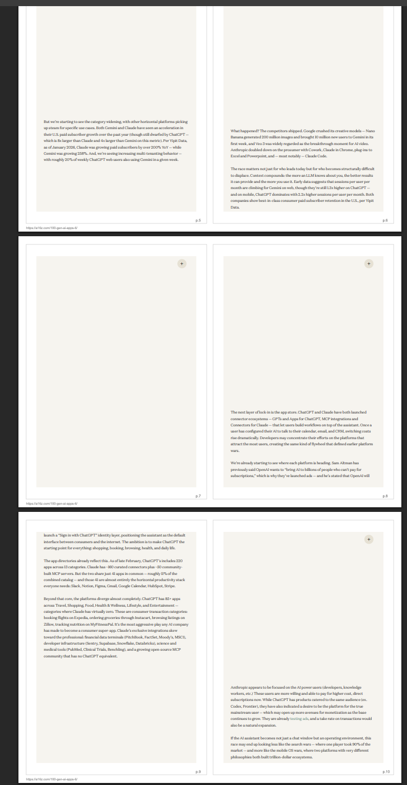
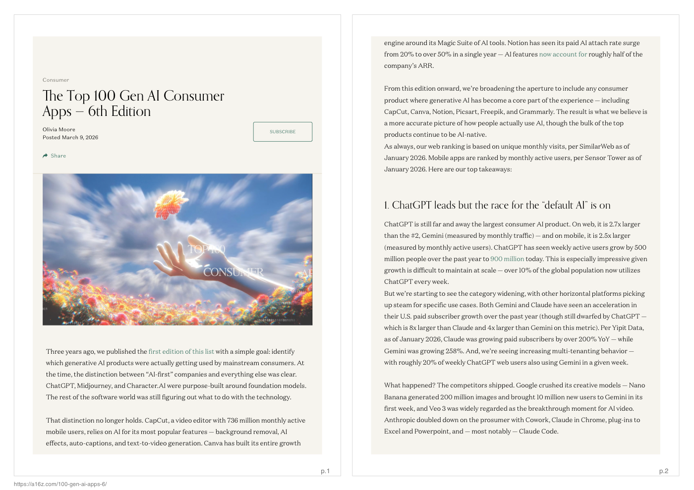

# EcoPrint

EcoPrint turns cluttered web pages into clean, printable PDFs designed to use less paper and less ink.

It does this in two steps:
1. Renders web pages in print mode while removing overlays, sticky UI, and oversized lightbox blocks.
2. Re-imposes pages into a 2-up layout (two pages per physical sheet) for compact printing.

## Why this exists

Most websites are optimized for scrolling, not printing. That creates waste:
- giant blank spaces,
- sticky elements captured in print,
- over-sized media cards,
- one page per sheet by default.

EcoPrint fixes that automatically so you can archive content on paper without wasting resources.

## Environmental impact

Real sample from this project:
- Sample URL: `https://a16z.com/100-gen-ai-apps-6/`
- Initial output: 25 print pages -> 13 sheets (2-up)
- After EcoPrint compaction improvements: 12 print pages -> 6 sheets (2-up)

That is a reduction of ~54% in printed sheets for this document.

At scale, fewer sheets usually means:
- lower paper consumption,
- fewer cartridge/toner changes,
- reduced print-time energy use,
- lower storage/shipping footprint for printed packets.

## Before and after

The screenshots below are from the actual iterations used to build this workflow.

### Before (wasted space)







### After (EcoPrint output preview)



## How it works

EcoPrint uses a headless browser + PDF post-processing pipeline:

1. Open URL in Chromium (via Playwright).
2. Force lazy assets to load (scroll pass + eager image settings).
3. Expand collapsible sections (`details`, `aria-expanded=false`, and common “read more” patterns).
4. Hide print-noise elements (sticky/fixed overlays, consent/login prompts).
5. In paper-save mode (default), remove oversized lightbox/zoom media wrappers that often create blank blocks.
6. Save a print-ready A4 PDF.
7. Re-layout into A4 landscape sheets with 2 pages per sheet using `pdf-lib`.

## Installation

```bash
npm install
```

## Usage

Single URL:

```bash
npm run pdf -- "https://example.com/article"
```

Multiple URLs:

```bash
npm run pdf -- "https://example.com/a" "https://example.com/b"
```

Custom output folder:

```bash
npm run pdf -- "https://example.com/article" --outdir ./out
```

Keep intermediate full-page PDF:

```bash
npm run pdf -- "https://example.com/article" --keep-source
```

Keep media lightbox blocks (disable paper-save media removal):

```bash
npm run pdf -- "https://example.com/article" --keep-media
```

## Browser configuration

EcoPrint needs a Chromium-based browser binary.

It tries these paths in order:
- `ECOPRINT_CHROME_PATH`
- `CHROME_PATH`
- `/Applications/Google Chrome.app/Contents/MacOS/Google Chrome`
- `/Applications/Chromium.app/Contents/MacOS/Chromium`

If your browser is elsewhere, set:

```bash
export ECOPRINT_CHROME_PATH="/path/to/chrome-or-chromium"
```

## Example artifacts

Generated sample files live in:
- `examples/output/a16z-com-100-gen-ai-apps-6.print.pdf`
- `examples/output/a16z-com-100-gen-ai-apps-6.2up.pdf`

## Limitations

- Some JS-heavy sites may still require domain-specific rules.
- Removing media blocks is intentionally aggressive in default paper-save mode.
- Very protected/paywalled pages may not render fully without authenticated session setup.

## License

MIT
